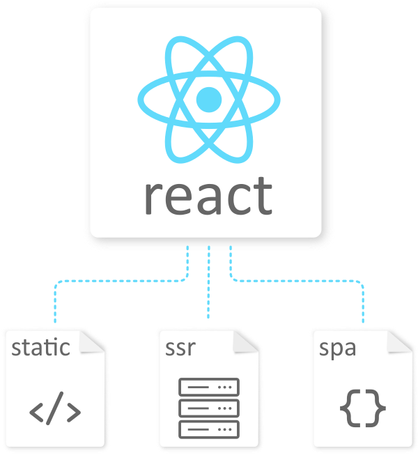

<h1 align="center">
  <a href="https://github.com/yandeu/react-to-static-or-ssr#readme"></a>  
  <br />
  React to Static or SSR
</h1>

<h4 align="center">
A react starter template for creating single page applications, static html files or a server side rendered app.</h4>

<p align="center">
  <a href="https://david-dm.org/yandeu/react-to-static-or-ssr" title="dependencies status">
    
  </a>
  <a href="https://opensource.org/licenses/MIT" title="License: MIT" >
    
  </a>
  
  <a href="https://github.com/prettier/prettier" alt="code style: prettier"></a>
</p>

## Demo

Check out how this [project look on AWS S3](http://react-to-static-or-ssr.s3-website.eu-central-1.amazonaws.com/), exported as static files. Works, of course, with or without JavaScript activated in your browser.

The email addresses and names are fetch from JSONPlaceholder. The demo tutorials are fetched from markdown files.

## Key Features

- Very easy to read and use
- Only 10 dependencies
- Using TypeScript
- SEO features with react-helmet (incl. SSR)
- Dynamic Pages using Markdown files (incl. YAML header)
- Async data fetching and rendering using only the react context api (no redux)
- Hydrates the react app after page load
- Uses react-router-config instead of react-router-dom for rendering the matching route
- LazyLoading will be implemented as soon as react.lazy() is available on the server side. (_You can implement @loadable/component for now, if you want_)
- css
  - Normal css (import ./some.css)
  - css modules (import styles from './some.module.css')
  - JSS (with SSR) _this is what I personally recommend, since it is directly rendered into the html file_

## Prefetching

Prefetching date is easy. See example below.

```tsx
// DisplayName.tsx
import React, { useEffect } from 'react'

import { clientStore, serverStore } from '../store/store'
import { fetchName } from '../store/actions'

const DisplayName = () => {
  const store = clientStore()

  useEffect(() => {
    store.dispatch(fetchName())
  }, [])

  return (
    <div>
      <section className="section">
        <div className="container">
          <h1>Prefetch Name</h1>
          <p>
            The prefetched name: <b>{store.state.name}</b>
          </p>
        </div>
      </section>
    </div>
  )
}

DisplayName.prefetchData = () => {
  return serverStore.dispatch(fetchName())
}

export default DisplayName
```

## MarkDown

It is possible to render dynamic pages using markdown. All markdown files are in `/public/markdown`.

The Tutorial component below fetches the content dynamically from a markdown file (with a yaml header) and renders the page.

```tsx
// Tutorial.tsx
import React, { useEffect } from 'react'
import { clientStore, serverStore } from '../store/store'
import { fetchPage } from '../store/actions'
import ParseMarkdown from '../Components/ParseMarkdown/ParseMarkdown'
import useParseMarkdown from '../Components/ParseMarkdown/useParseMarkdown'
import Hero from '../Components/Hero/Hero'

const Tutorial = props => {
  const id: string = props.match?.params?.id
  const store = clientStore()
  const { yaml, markdown } = useParseMarkdown(store.state.page)

  useEffect(() => {
    store.dispatch(fetchPage(`/markdown/tutorials/${id}.md`))
  }, [id])

  return (
    <div>
      <Hero title={yaml.title} subtitle={yaml.description} />
      <section>
        <div className="container">
          <div style={{ paddingBottom: 32 }}>
            Author: <a href={yaml.author?.website}>{yaml.author?.name}</a>
          </div>
          <ParseMarkdown markdown={markdown} />
        </div>
      </section>
    </div>
  )
}

Tutorial.prefetchData = ({ url, origin }) => {
  return serverStore.dispatch(fetchPage(`${origin}/markdown${url}.md`))
}

export default Tutorial
```

## Scripts

### Development

- `npm start` or `npm run dev` to run the webpack dev server
- `npm spa` start app with SPA server
- `npm ssr` start app with SSR server
- `npm static` start app with STATIC server

### Build

run `npm spa:build` or `npm ssr:build` or `npm static:build`

### Serve

Serve the app after you have build the production ready code.

run `npm spa:serve` or `npm ssr:serve` or `npm static:serve`

## Ports

- Port 8080 (dev)
- Port 3050 (spa)
- Port 3060 (ssr)
- Port 3070 (static)

## License

The MIT License (MIT) 2019 - [Yannick Deubel](https://github.com/yandeu). Please have a look at the [LICENSE](LICENSE) for more details.
